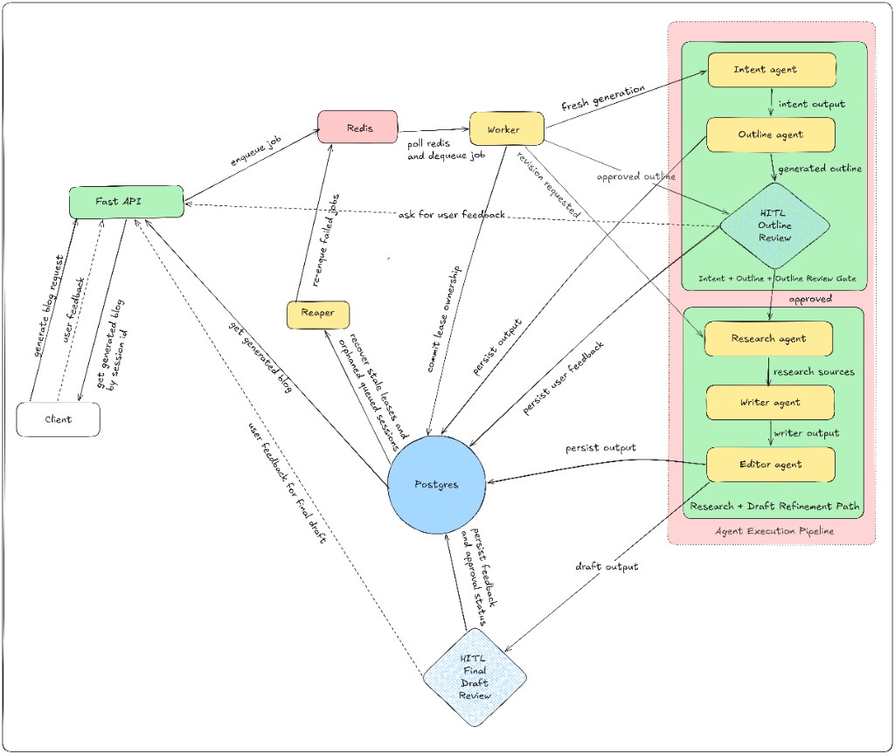

# Blogify AI — Production Blog Generation System

Production-grade, multi-agent blog generation system built on **Google ADK**, **FastAPI**, and **PostgreSQL**. Features a human-in-the-loop review workflow at the outline and final draft stages.

## System Architecture



> **FastAPI** receives generation requests, enqueues jobs to **Redis**, and a background **Worker** runs the AI pipeline. **PostgreSQL** is the canonical state store. A separate **Reaper** process handles stale-lease recovery and queue reconciliation. Two Human-in-the-Loop gates pause execution for user review before research and before final approval.

## Features

- 🤖 **Multi-Agent Pipeline** — Intent → Outline → HITL Outline Review → Research → Writer ⟷ Editor → HITL Final Draft Review
- 👁️ **Human-in-the-Loop (HITL)** — Two mandatory review checkpoints with approve / revise / reject flows
- 💰 **Budget Enforcement** — Append-only ledger with reserve / commit / release semantics; per-user, per-tenant, and per-service-client daily caps
- 🚦 **Rate Limiting** — Global and per-user limits backed by Redis
- 🔄 **Worker Recovery** — Reaper detects stale leases, stale Redis processing entries, and queued-session drift
- 📊 **Observability** — Prometheus metrics, Grafana dashboards, Tempo distributed tracing (OTLP)
- 🛡️ **Auth** — Cookie-based browser auth, internal API-key auth (`X-Internal-Api-Key`), admin API-key auth (`X-Admin-Api-Key`)

## Tech Stack

| Layer | Technology |
|---|---|
| API | FastAPI (Python 3.11+) |
| AI Orchestration | Google ADK |
| Background Worker | Custom async worker (`src.workers.blog_worker`) |
| Queue | Redis (List/Stream) |
| Database | PostgreSQL 16 (SQLAlchemy + asyncpg + Alembic) |
| Frontend | React 19 + TypeScript + Vite |
| Observability | Prometheus · Grafana · Tempo (OTLP) |
| Logging | structlog (JSON in stage/prod) |

## Agent Pipeline

```
POST /api/v1/blogs/generate
        │
        ▼
   [Intent Agent]
        │  intent output
        ▼
   [Outline Agent]
        │  generated outline
        ▼
 ◆ HITL Outline Review ◆   ← user must approve or edit
        │  approved outline
        ▼
   [Research Agent]  (Tavily)
        │  research sources
        ▼
   [Writer Agent]
        │  writer output
        ▼
   [Editor Agent]
        │  final draft
        ▼
 ◆ HITL Final Draft Review ◆  ← approve / revision_requested / reject
        │
        ▼
      COMPLETED
```

### Pipeline Phases & Resume Paths

| Phase | Trigger | Worker entrypoint | Result state |
|---|---|---|---|
| `fresh_generation` | `POST /blogs/generate` | `_execute_fresh_generation` | `AWAITING_OUTLINE_REVIEW` |
| `resume_outline` | Outline approved by user | `_execute_resume_outline` | `AWAITING_FINAL_REVIEW` |
| `research_phase` | Stale-worker recovery after outline already consumed | `_execute_research_phase` | `AWAITING_FINAL_REVIEW` |
| `revision` | Final review → `revision_requested` | `_execute_revision` (runs from `research_phase`) | `AWAITING_FINAL_REVIEW` |

## Setup

### Prerequisites

- Python 3.11+
- PostgreSQL 16
- Redis 7
- Docker & Docker Compose (recommended)
- Node.js 20+ (for frontend)

### Backend Installation

```bash
cd backend

# Create and activate virtual environment
python -m venv venv
source venv/bin/activate

# Install in editable mode
pip install -e .
```

### Configuration

```bash
# Copy the production env template (or .env.dev for local dev)
cp .env.prod.example .env
```

Required environment variables:

| Variable | Required | Description |
|---|---|---|
| `DATABASE_URL` | ✅ | PostgreSQL async connection string |
| `REDIS_URL` | ✅ | Redis connection string |
| `GOOGLE_API_KEY` | ✅ | Google Gemini API key |
| `TAVILY_API_KEY` | ✅ | Tavily search API key |
| `JWT_SECRET_KEY` | Stage / Prod | Secret for cookie signing |
| `ADMIN_API_KEY` | Stage / Prod | Admin operator API key |
| `CORS_ORIGINS` | Stage / Prod | Comma-separated allowed origins |

### Database Migration

```bash
cd backend
alembic upgrade head
```

## Running the Service

### Local Development (Docker Compose)

```bash
cd backend
docker compose -f docker-compose.base.yml -f docker-compose.local.yml up
```

This starts all services:

| Service | Port | Description |
|---|---|---|
| `api` | 8000 | FastAPI application |
| `worker` | — | Blog generation worker (2 replicas) |
| `reaper` | — | Stale-lease recovery process |
| `frontend` | 3001 | React + Vite UI |
| `postgres` | 5432 | PostgreSQL 16 |
| `redis` | 6379 | Redis 7 |
| `prometheus` | 9090 | Metrics scraper |
| `grafana` | 3000 | Dashboards (admin/admin) |
| `tempo` | 4317 | OTLP trace ingest |

### Running Services Individually

```bash
# API
uvicorn src.api.main:app --reload --host 0.0.0.0 --port 8000

# Worker
python -m src.workers.blog_worker

# Reaper (separate process — do NOT run inside the worker)
python -m src.workers.reaper
```

## API Endpoints

### Health Check
```bash
curl http://localhost:8000/api/health
```

### Generate a Blog
```bash
curl -X POST http://localhost:8000/api/v1/blogs/generate \
  -H "Content-Type: application/json" \
  -H "Idempotency-Key: my-unique-key-001" \
  -d '{
    "topic": "The Future of AI in Healthcare",
    "audience": "healthcare professionals",
    "tone": "professional"
  }'
# → 202 Accepted { session_id, status }
```

### Poll Session Status
```bash
curl http://localhost:8000/api/v1/blogs/{session_id}/status
```

### Submit Outline Review
```bash
curl -X POST http://localhost:8000/api/v1/blogs/{session_id}/outline/review \
  -H "Content-Type: application/json" \
  -d '{"action": "approve", "edited_outline": {...}}'
```

### Submit Final Draft Review
```bash
curl -X POST http://localhost:8000/api/v1/blogs/{session_id}/final-review \
  -H "Content-Type: application/json" \
  -d '{"action": "approve"}'
# action: "approve" | "revision_requested" | "reject"
```

### Get Final Blog Content
```bash
curl http://localhost:8000/api/v1/blogs/{session_id}/content
```

### Get Budget
```bash
curl http://localhost:8000/api/v1/blogs/budget
```

## Project Structure

```
.
├── backend/
│   ├── src/
│   │   ├── agents/          # Intent, Outline, Research, Writer, Editor agents + pipeline.py
│   │   ├── api/             # FastAPI app, auth middleware, routes
│   │   ├── config/          # Env config, budget config, logging config
│   │   ├── controllers/     # Command handlers
│   │   ├── core/            # Database, Redis pool, task queue
│   │   ├── guards/          # Input validation
│   │   ├── models/          # ORM models, schemas, repositories
│   │   ├── monitoring/      # Prometheus metrics
│   │   ├── services/        # Blog service, budget service, auth service
│   │   ├── tools/           # Tavily MCP tool
│   │   └── workers/         # blog_worker.py, executor.py, reaper.py
│   ├── alembic/             # Database migrations
│   ├── docs/                # Architecture docs, ADRs, audit reports
│   ├── tests/               # Unit, integration, smoke tests
│   ├── docker-compose.base.yml
│   ├── docker-compose.local.yml
│   └── docker-compose.prod.yml
├── frontend/                # React 19 + TypeScript + Vite
└── docs/                    # Root-level docs (DB schema, deploy runbooks)
```

## Testing

```bash
cd backend

# Run full test suite
pytest

# With coverage
pytest --cov=src tests/

# Specific suites
pytest tests/unit/
pytest tests/integration/
```

## Observability

### Prometheus Metrics

Access at `http://localhost:9090`

Key metrics include:
- `blog_generations_total` / `blog_generation_duration_seconds`
- `agent_invocation_total` / `agent_token_usage` / `agent_cost_usd`
- `budget_exceeded_total` / `service_client_budget_preflight_total`
- `rate_limit_rejections_total`
- HTTP request counts and latency

### Grafana Dashboards

Access at `http://localhost:3000` (default: admin / admin)

Provisioned dashboards:
- API overview
- Pipeline overview
- Budget and review operations

### Distributed Tracing (Tempo)

OTLP traces exported to Tempo at `http://localhost:4317`.
Integrated via `OTEL_EXPORTER_OTLP_ENDPOINT`.
SQLAlchemy and FastAPI instrumentation are active when OTEL dependencies are present.

## Environment Profiles

| Profile | Rate Limits | Log Format | CORS |
|---|---|---|---|
| `local` / `dev` | Relaxed | text | Permissive |
| `stage` | Moderate | JSON | Specific domains |
| `prod` | Strict | JSON | Explicit whitelist |

## Architecture Documentation

Detailed architecture references are in `backend/docs/`:

- [`ARCHITECTURE-blogify.md`](backend/docs/ARCHITECTURE-blogify.md) — **Current architecture source of truth**
- [`ADR-2026-06-17-pipeline-phase-and-loop-semantics.md`](backend/docs/ADR-2026-06-17-pipeline-phase-and-loop-semantics.md) — Phase/loop naming decisions
- [`ADR-2026-06-17-redis-queue-recovery-reconciliation.md`](backend/docs/ADR-2026-06-17-redis-queue-recovery-reconciliation.md) — Queue recovery design
- [`ADR-2026-05-30-worker-recovery-versioned-state.md`](backend/docs/ADR-2026-05-30-worker-recovery-versioned-state.md) — Worker recovery and versioned state

## License

MIT
