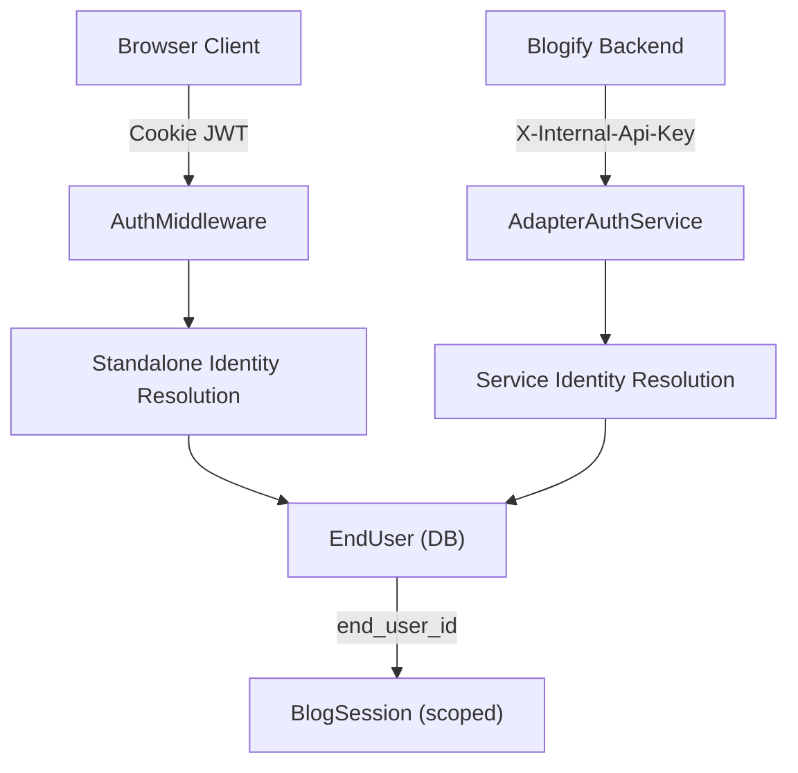
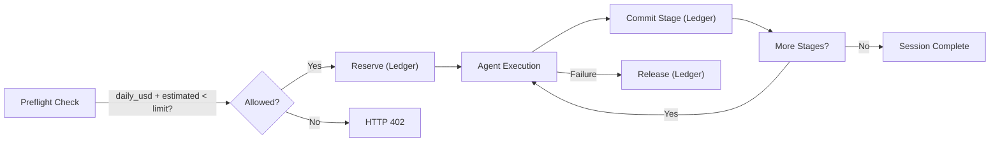
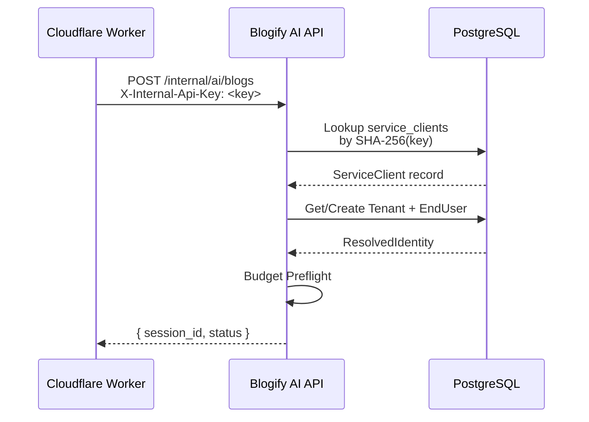

# Blogify AI ADK — Production Readiness Audit Report

> **Date**: 2026-03-25 | **Scope**: Deployment readiness, Auth & Isolation, Budget Service, Observability, Backend Key Access

---

## 1. Deployment Readiness Assessment

**Verdict: 🟡 Partially Ready — Several Blocking Issues**

### ✅ What's Good

| Area | Status | Notes |
|------|--------|-------|
| Dockerfile | ✅ Solid | Multi-stage build, non-root user, health check, `PYTHONUNBUFFERED` |
| Docker Compose | ✅ Good | API + Worker + Redis + Prometheus + Grafana |
| Kubernetes | ✅ Present | Deployment, ConfigMap, secrets template, worker deployment |
| CI/CD Pipeline | ✅ Present | GitHub Actions: test → lint → build → deploy to Cloud Run |
| Database Migrations | ✅ Present | Alembic with 4 versions |
| Env Config | ✅ Tiered | Dev/Stage/Prod configs with `pydantic-settings` |
| Startup Checks | ✅ Robust | Pre-flight validation of DB, Redis, env vars, configuration |
| Graceful Shutdown | ✅ Present | Signal handlers, connection draining, resource cleanup |
| Health Endpoints | ✅ Present | `/api/health`, `/health/live`, `/health/ready`, `/health/detailed` |

### 🔴 Blocking Issues

#### 1.1 CI Pipeline Python Version Mismatch
- **CI** uses `python: '3.10'`, but **Dockerfile** uses `python:3.11-slim`
- **Risk**: Tests pass on 3.10 but fail on 3.11 (or vice versa) due to syntax/behavior differences
- **Fix**: Align CI to `python: '3.11'`

#### 1.2 CI Build Context Incorrect
- [docker-compose.yml](file:///home/bot/repos/development/blogify-ai-adk-prod/backend/docker-compose.yml#L7) sets `context: ./backend` but it's inside `backend/` already
- CI [build step](file:///home/bot/repos/development/blogify-ai-adk-prod/.github/workflows/ci.yml#L98) uses `context: .` (monorepo root) but `Dockerfile` expects `requirements.txt`, `src/` etc. next to it
- **Fix**: Set CI build context to `./backend` or restructure Dockerfile `COPY` paths

#### 1.3 No `app.py` Copied in Dockerfile
- The Dockerfile `CMD` runs `src.api.main:app`, but `app.py` (the entrypoint that patches `sys.path`) is never copied
- This works because `PYTHONPATH=/app` is set — but the `app.py` entrypoint is orphaned
- **Fix**: Remove `app.py` or ensure Dockerfile copies it

#### 1.4 Missing Database Service in CI
- CI [test job](file:///home/bot/repos/development/blogify-ai-adk-prod/.github/workflows/ci.yml#L44-L46) has `DATABASE_URL` pointing to `localhost:5432` but **no PostgreSQL service** is defined (only Redis)
- **Fix**: Add PostgreSQL service container to CI

#### 1.5 Production CORS Origins Empty
- [ProductionConfig](file:///home/bot/repos/development/blogify-ai-adk-prod/backend/src/config/env_config.py#L148) defaults `cors_origins: list[str] = []`, validated at startup
- If the env var is not properly set, the frontend won't be able to connect
- **Fix**: Ensure `CORS_ORIGINS` env is explicitly set in prod deployment

#### 1.6 `enable_canonical_routes = False` by Default
- [BaseConfig](file:///home/bot/repos/development/blogify-ai-adk-prod/backend/src/config/env_config.py#L93) defaults to `enable_canonical_routes: bool = False`
- Only `ProductionConfig` sets it to `True`. Dev/Stage must set it via env var
- **Risk**: Routes silently disappear in non-prod environments
- **Fix**: Default to `True` for all environments, or at minimum for staging

#### 1.7 Missing OpenTelemetry Dependencies in `requirements.txt`
- [requirements.txt](file:///home/bot/repos/development/blogify-ai-adk-prod/backend/requirements.txt) does **not** include any `opentelemetry-*` packages
- The tracing module gracefully falls back but this means **tracing is dead in production**
- **Fix**: Add `opentelemetry-api`, `opentelemetry-sdk`, `opentelemetry-exporter-otlp`, and instrumentor packages

---

## 2. Authentication & Per-User Data Isolation

**Verdict: 🟢 Well Implemented — Minor Gaps**

### Architecture Overview



### ✅ What's Working

| Feature | Implementation | File |
|---------|---------------|------|
| Cookie-based JWT auth | HMAC-SHA256 signed, HttpOnly, SameSite, expiry validated | [local_auth_service.py](file:///home/bot/repos/development/blogify-ai-adk-prod/backend/src/services/local_auth_service.py) |
| Password hashing | `scrypt` with random salt, timing-safe comparison | [local_auth_service.py](file:///home/bot/repos/development/blogify-ai-adk-prod/backend/src/services/local_auth_service.py#L51-L66) |
| Auth middleware | Attaches `user_id` to `request.state` on every request | [auth.py](file:///home/bot/repos/development/blogify-ai-adk-prod/backend/src/api/auth.py#L25-L86) |
| Session ownership | `_assert_owned_session()` checks `EndUser.external_user_id` | [canonical.py](file:///home/bot/repos/development/blogify-ai-adk-prod/backend/src/api/routes/canonical.py#L192-L195) |
| All CRUD routes guarded | Every standalone route calls `require_authenticated_user()` | [canonical.py](file:///home/bot/repos/development/blogify-ai-adk-prod/backend/src/api/routes/canonical.py#L607-L761) |
| CSRF protection | `X-Requested-With: XMLHttpRequest` header required on mutations | [auth.py](file:///home/bot/repos/development/blogify-ai-adk-prod/backend/src/api/auth.py#L115-L119) |
| Multi-tenant model | `ServiceClient → Tenant → EndUser` hierarchy | [orm_models.py](file:///home/bot/repos/development/blogify-ai-adk-prod/backend/src/models/orm_models.py#L156-L256) |

### 🟡 Issues

#### 2.1 Auth Middleware Doesn't Block Unauthenticated Requests
- [AuthMiddleware](file:///home/bot/repos/development/blogify-ai-adk-prod/backend/src/api/auth.py#L49-L71) sets `request.state.authenticated = False` but **never returns a 401**
- Protection happens only when route handlers explicitly call `require_authenticated_user()`
- If a developer adds a new route and forgets `require_authenticated_user()`, it's open
- **Fix**: Consider making the middleware reject unauthenticated requests for non-public routes by default (currently `required` param is unused)

#### 2.2 `/api/v1/costs` Endpoint is Unauthenticated
- [get_cost_summary](file:///home/bot/repos/development/blogify-ai-adk-prod/backend/src/api/main.py#L218-L255) accepts `user_id` as a **query parameter** with no auth
- Any caller can view any user's cost data by guessing `user_id`
- **Fix**: Move behind authentication; derive `user_id` from JWT claims

#### 2.3 `/api/v1/system/info` Endpoint is Unauthenticated
- [system_info](file:///home/bot/repos/development/blogify-ai-adk-prod/backend/src/api/main.py#L258-L279) exposes configuration details to any caller
- **Fix**: Restrict to admin role or remove in production

#### 2.4 Hardcoded Default JWT Secret
- [LocalAuthService](file:///home/bot/repos/development/blogify-ai-adk-prod/backend/src/services/local_auth_service.py#L44) falls back to `"dev-blogify-local-auth-secret"`
- In production, if `JWT_SECRET_KEY` env var is missing, all tokens are signed with a known key
- **Fix**: Make `JWT_SECRET_KEY` a required env var in production; fail startup if missing

#### 2.5 Seed User with Hardcoded Credentials
- [ensure_seed_user](file:///home/bot/repos/development/blogify-ai-adk-prod/backend/src/services/local_auth_service.py#L118-L128) creates `dev@blogify.local / devpassword123`
- This runs on **every startup** including production
- **Fix**: Skip seed user creation when `ENVIRONMENT=prod`

#### 2.6 No "List My Blogs" Endpoint
- Users can only access individual sessions by ID. There's no endpoint to list all blogs for the authenticated user
- **Fix**: Add `GET /api/v1/blogs` that queries `BlogSession` filtered by `end_user_id`

---

## 3. Budget Service Analysis

**Verdict: 🟢 Well Designed — One Accounting Bug**

### Architecture



### ✅ What's Working

| Feature | Implementation |
|---------|---------------|
| DB-persisted budget ledger | `BudgetLedgerEntry` — append-only, immutable journal in PostgreSQL |
| Per-user daily limits | `BudgetPolicy` with scope cascade: `user_override → tenant → default` |
| Preflight checks | Validates daily USD, daily tokens, and per-session limits before generation |
| Reserve/Commit/Release cycle | Budget reserved pre-generation, committed per-stage, released on failure |
| Cross-device enforcement | All data is in PostgreSQL — works across any device/session |
| Budget snapshot API | `GET /api/v1/budgets/me` returns current spend and remaining limits |
| Budget exhaustion status | Session marked `budget_exhausted` and HTTP 402 returned |

### 🔴 Accounting Bug

#### 3.1 `release` Entries Not Subtracted from Daily Spend
- [get_daily_spent](file:///home/bot/repos/development/blogify-ai-adk-prod/backend/src/models/repositories/budget_repository.py#L88-L103) sums `COMMIT + RESERVE` entries but **does not subtract `RELEASE` entries**
- When a session fails and budget is released, the next preflight still counts the released amount as spent
- **Result**: Users get permanently locked out of their daily budget after a failed generation
- **Fix**: Either subtract `RELEASE` entries in `get_daily_spent`, or use a running balance approach

#### 3.2 Legacy Cost API Uses Different Data Source
- [get_cost_summary](file:///home/bot/repos/development/blogify-ai-adk-prod/backend/src/api/main.py#L218-L255) calls `_db.get_user_daily_cost()` which queries the **legacy** `cost_records` table
- The canonical budget system uses `budget_ledger_entries`
- **Result**: Two independent cost-tracking systems that can drift
- **Fix**: Deprecate the legacy endpoint or unify the data source

---

## 4. Observability Pipeline

**Verdict: 🟡 Partially Implemented — Key Gaps**

### ✅ What's Present

| Layer | Tool | Status |
|-------|------|--------|
| **Structured Logging** | `structlog` with JSON renderer | ✅ Working |
| **Request Correlation** | `X-Request-ID` middleware | ✅ Working |
| **Request Metrics** | Prometheus counters + histograms | ✅ Defined |
| **Business Metrics** | Blog generation, agent, budget, judge metrics | ✅ Defined |
| **Metrics Scraping** | Prometheus config targeting `api:8000` | ✅ Configured |
| **Dashboarding** | Grafana provisioned in docker-compose | ✅ Present |
| **Tracing Code** | OpenTelemetry + OTLP exporter | ✅ Written |

### 🔴 Critical Issues

#### 4.1 `instrument_app()` Is Never Called
- Imported in [main.py:25](file:///home/bot/repos/development/blogify-ai-adk-prod/backend/src/api/main.py#L25) but **never invoked**
- FastAPI, HTTPX, Redis, and SQLAlchemy are **not instrumented** for distributed tracing
- `init_tracing()` is called but only sets up the provider — requests generate **zero spans**
- **Fix**: Call `instrument_app(app)` in the lifespan handler after `init_tracing()`

#### 4.2 OpenTelemetry Packages Not in Dependencies
- [requirements.txt](file:///home/bot/repos/development/blogify-ai-adk-prod/backend/requirements.txt) has zero `opentelemetry-*` packages
- The tracing module's `try/except ImportError` silently disables all tracing
- **Fix**: Add to requirements:
  ```
  opentelemetry-api
  opentelemetry-sdk
  opentelemetry-exporter-otlp-proto-grpc
  opentelemetry-instrumentation-fastapi
  opentelemetry-instrumentation-httpx
  opentelemetry-instrumentation-redis
  opentelemetry-instrumentation-sqlalchemy
  ```

#### 4.3 No OTLP Collector in Docker Compose
- Prometheus + Grafana are provisioned, but **no Jaeger/Tempo/OTLP collector** for traces
- Even with `instrument_app()` called, traces have nowhere to go
- **Fix**: Add Jaeger or Grafana Tempo to docker-compose and configure `OTEL_EXPORTER_OTLP_ENDPOINT`

#### 4.4 No Grafana Dashboard Provisioning
- `grafana/provisioning/` directory exists but no dashboard JSON files were found
- Grafana starts empty with no pre-built dashboards
- **Fix**: Create dashboard JSON files for request rates, latencies, budget consumption, and agent performance

#### 4.5 Metrics Defined But Not All Emitted
- Many Prometheus metrics are [defined](file:///home/bot/repos/development/blogify-ai-adk-prod/backend/src/monitoring/metrics.py) (e.g., `judge_decisions_total`, `daily_cost_usd` gauge) but a search indicates some are never `.inc()` or `.set()` in application code
- **Fix**: Audit metric usage — emit all defined metrics at their corresponding code paths

#### 4.6 No Log Aggregation in Production
- Structured JSON logs go to stdout (good for containers) but no ELK/Loki/CloudWatch setup
- **Fix**: For Cloud Run deployment, ensure logs are captured by Cloud Logging; for K8s, add Loki or Fluentd

#### 4.7 `instrument_database()` Never Called
- [instrument_database](file:///home/bot/repos/development/blogify-ai-adk-prod/backend/src/monitoring/tracing.py#L113-L127) exists but is never called on the SQLAlchemy engine
- **Fix**: Call after engine creation in startup

---

## 5. Backend Key Access for External Apps

**Verdict: 🟢 Well Designed — Ready for Integration**

### Architecture



### ✅ What's Working

| Feature | Implementation |
|---------|---------------|
| API key authentication | `X-Internal-Api-Key` header, SHA-256 hashed lookup against `service_clients` table |
| Client mode validation | Only `blogify_service` mode keys can access internal routes |
| Identity resolution | `AdapterAuthService.resolve_service_mode()` creates tenant/user automatically |
| Idempotency | `external_request_id` for deduplication |
| Full CRUD access | All blog lifecycle endpoints mirrored under `/internal/ai/blogs/*` |
| Budget enforcement | Same preflight/reserve/commit pattern applies to service mode |
| Webhook callback | `callback_url` field in request body for async notifications |

### 🟡 Issues

#### 5.1 Internal Routes Only Check for Key Presence, Not Validity
- Service GET routes (e.g., [service_get_session](file:///home/bot/repos/development/blogify-ai-adk-prod/backend/src/api/routes/canonical.py#L806-L817)) only check `if not x_internal_api_key` but **don't validate the key** against the database
- The POST route (`/internal/ai/blogs`) does validate via `_resolve_service_identity()`, but GETs skip validation
- **Risk**: Any value in `X-Internal-Api-Key` header bypasses auth on read endpoints
- **Fix**: Call `_resolve_service_identity()` on all internal routes, not just POST

#### 5.2 No API Key Rotation/Revocation Support in API
- The DB model supports `ROTATED` status and `rotated_at` timestamp, but there's no admin API to rotate or revoke keys
- **Fix**: Add admin endpoints for key management: create, rotate, revoke

#### 5.3 No Rate Limiting on Internal Routes
- Internal routes bypass the standard rate limiting middleware
- A misbehaving downstream service could exhaust resources
- **Fix**: Add per-client rate limiting on internal routes

---

## Summary Of All Issues by Severity

### 🔴 Critical (Must Fix Before Deployment)

| # | Area | Issue | Fix |
|---|------|-------|-----|
| 1 | Auth | Hardcoded JWT secret fallback | Make `JWT_SECRET_KEY` required in prod |
| 2 | Auth | `/api/v1/costs` unauthenticated | Add auth, derive user from JWT |
| 3 | Auth | Seed user created in prod | Skip when `ENVIRONMENT=prod` |
| 4 | Budget | `release` entries not subtracted | Fix `get_daily_spent()` query |
| 5 | Observability | `instrument_app()` never called | Call in lifespan handler |
| 6 | Observability | OpenTelemetry deps missing | Add to `requirements.txt` |
| 7 | Deploy | CI Python version mismatch | Align to 3.11 |
| 8 | Deploy | CI missing PostgreSQL service | Add PG service container |
| 9 | Backend Key | Internal GET routes don't validate key | Call `_resolve_service_identity()` |

### 🟡 Important (Should Fix)

| # | Area | Issue | Fix |
|---|------|-------|-----|
| 10 | Auth | Middleware doesn't enforce auth | Use the `required` parameter |
| 11 | Auth | No "list my blogs" endpoint | Add `GET /api/v1/blogs` |
| 12 | Auth | `/api/v1/system/info` exposes config | Restrict or remove in prod |
| 13 | Budget | Legacy cost API uses different table | Unify or deprecate |
| 14 | Observability | No OTLP collector in docker-compose | Add Jaeger/Tempo |
| 15 | Observability | No Grafana dashboards provisioned | Create dashboard JSONs |
| 16 | Observability | Some metrics defined but never emitted | Audit and wire up |
| 17 | Backend Key | No API key rotation/revocation API | Add admin endpoints |
| 18 | Backend Key | No rate limiting on internal routes | Add per-client limits |

### 🟢 Nice to Have

| # | Area | Issue | Fix |
|---|------|-------|-----|
| 19 | Deploy | `enable_canonical_routes` default `False` | Default `True` for staging |
| 20 | Deploy | CI build context may be wrong | Verify context path |
| 21 | Observability | No log aggregation setup | Configure Cloud Logging / Loki |
| 22 | Observability | `instrument_database()` never called | Call on engine creation |
