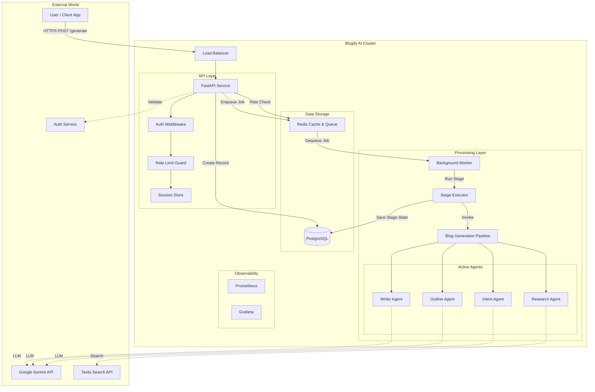
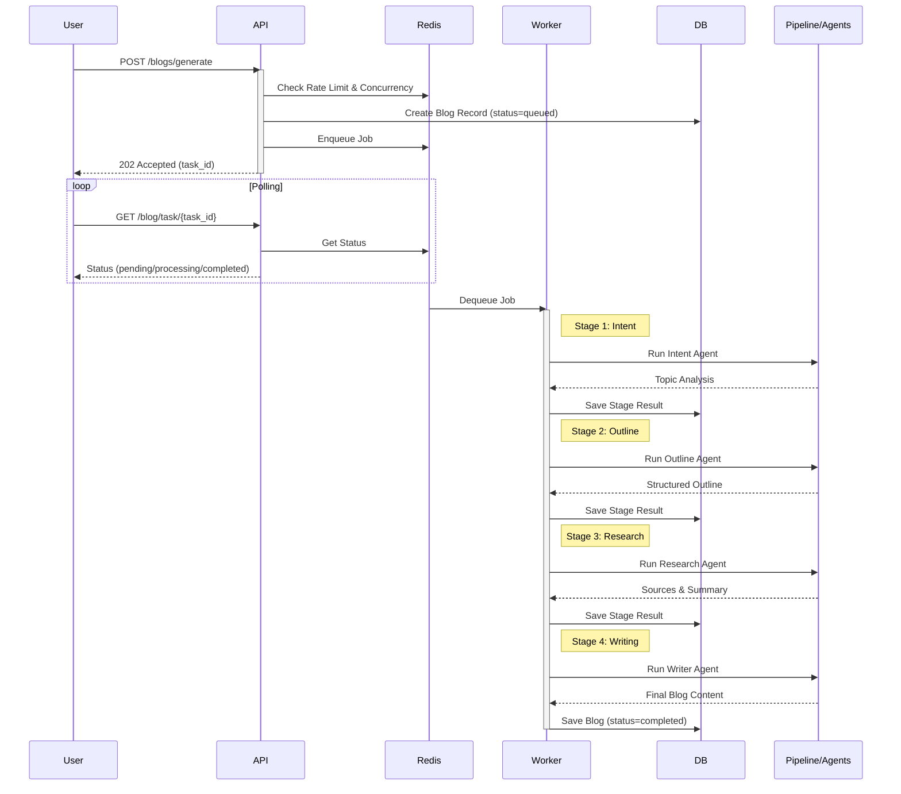

# System Architecture

## High-Level Architecture

The Blogify AI system is built on a microservices-like architecture using FastAPI for the core service, Celery-like background workers for asynchronous processing, and Google's Agent Development Kit (ADK) for AI orchestration.

## Blog Generation Pipeline Flow

The system uses a fully automated, multi-stage pipeline executed by background workers. Human-in-the-Loop (HITL) features are deprecated; the process runs from intent to completion without intervention.

## Core Components

### 1. API Service (`src/api`)
- **Role**: Entry point and control plane.
- **Key Features**: 
  - **Backpressure**: Rejects requests when queue depth or concurrency limits are exceeded (503 Service Unavailable).
  - **Idempotency**: Prevents duplicate processing using `Idempotency-Key` headers.
  - **Stateless**: No long-running jobs in the API layer; all heavy lifting is offloaded.

### 2. Background Worker (`src/workers`)
- **Role**: Asynchronous execution of blog generation.
- **Stage Executor**: Manages the state machine transitions (`Intent` -> `Outline` -> `Research` -> `Writing`).
- **Resilience**: Handles job visibility timeouts, retries with exponential backoff, and crash recovery.

### 3. Blog Generation Pipeline (`src/agents`)
- **Role**: Deterministic orchestration of AI agents.
- **Agents**:
  - **Intent Agent**: Validates topic clarity.
  - **Outline Agent**: Structures the blog post.
  - **Research Agent**: Uses Tavily to fetch real-time data.
  - **Writer Agent**: Synthesizes outline and research into final markdown.
  *Note: The `Editor` agent exists in the codebase but is currently inactive in the production pipeline.*

### 4. Infrastructure
- **Redis**: 
  - Token bucket rate limiting.
  - Job queue (List/Stream).
  - Session/Idempotency storage.
- **PostgreSQL**: 
  - relational data (Users, Blogs).
  - JSONB storage for intermediate stage results.
